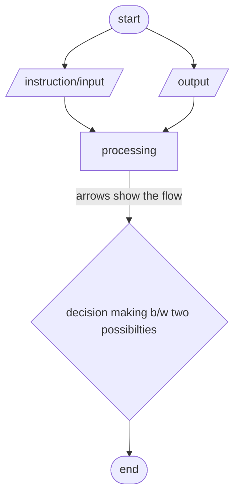
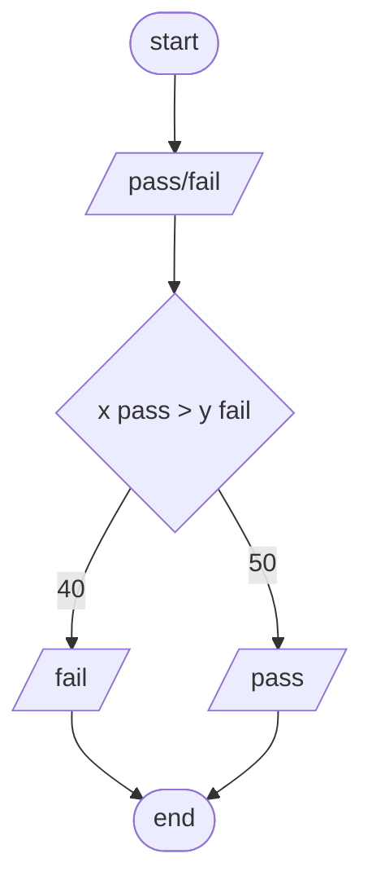

# Fundamentals of programming ✏️

### Basic fundamental 📣

The computer is based on 10 basic fundamentals
1. **input/output**:

   input/output are the most basic fundamentals of a program 
  ```mermaid
     flowchart LR
     A[input] --> B[user or external source]
     C[output] --> D[viewing results] 
  ```
   the input and output are the working fundamentals of a program which is subdivided into other aspects

2. **variables**:

   variables: acts a major role in the program.  Variables are given names that describe the kind of data they hold. Variable names typically consist of letters, numbers, and underscores, but they must follow certain rules (e.g., they cannot start with a number).

3. **data types**:

   Variables can hold different types of data, such as numbers, strings (sequences of characters), boolean values (true/false), and more complex data structures like arrays and objects.

4. **Declaration**:

   Before using a variable in a program, it must be declared, which tells the computer's memory system to allocate space for it. The declaration typically includes the variable's name and data type.

5. **Initialization**:

   Variables can be initialized with an initial value at the time of declaration, or they can be assigned a value later in the program.

6. **Scope**:

   Variables have a scope, which defines where in the program they are accessible. Variables can have local scope (accessible only within a specific block of code) or global scope (accessible throughout the entire program).
   ```
   #include <iostream>
   using namespace std;
   
   int main() {
       // Variable declaration and initialization
       int age = 25;
       string name = "John";
       bool is_student = true;
   
       // Printing variable values
       cout << "Name: " << name << endl;
       cout << "Age: " << age << endl;
       cout << "Is student? " << (is_student ? "Yes" : "No") << endl;
   
       // Variable reassignment
       age = 30;
       cout << "Updated age: " << age << endl;
   
       return 0;
   }
   ```
    * age, name, and is_student are variables.
    * age is an integer variable initialized with the value 25.
    * name is a string variable initialized with the value "John".
    * is_student is a boolean variable initialized with the value true.
    * The cout statement is used to print the values of these variables.
    * age is reassigned a new value of 30.
    * The program outputs the values of the variables and the updated value of age.
    * Remember that in C++, you need to include the appropriate header files (<iostream> in this case) and use the using namespace std; directive to avoid typing std:: before standard library elements like cout and endl


7. **data types**:

   Here are a few examples of data types
   * **Integer**: Used to store whole numbers without any decimal point. Examples include 1, -5, 1000.
   * **Floating-point**: Used to store numbers with decimal points. Examples include 3.14, -0.5, 10.0
   * **Character**: Used to store individual characters. Examples include 'a', 'B', '$'
   * **String**: Used to store sequences of characters. Examples include "hello", "world", "123".
   * **Boolean**: Used to represent true or false values. Examples include true, false.
   * **Array**: Used to store a collection of elements of the same data type. Examples include [1, 2, 3], ['apple', 'banana', 'orange'].

8. **control structures**

   Control structures allow you to control the flow of a program. Common control structures include conditional statements (if-else statements), loops (for loops, while loops), and switch statements

9. **data structures**

    Data structures are ways of organizing and storing data to efficiently perform operations on them. Common data structures include arrays, linked lists, stacks, queues, trees, and hash tables.

10. **Algorithms**

    Algorithms are step-by-step procedures for solving problems. Understanding basic algorithms and their analysis (e.g., searching, sorting, recursion) is essential for writing efficient code

11. **debugging/testing**

    debugging and testing is used to see if the program is running properly and is bug-free

### class tasks no: 01
* make an algorithm flowchart
* solve a problem using algorithm seqeuance
#### given problems 
1. calculate the area of room
2. make an auto-system for grading
### algorithm model 

### make an auto-grading system 

## lab tasks #01
* make a flowchart & pseudo-code of add two numbers
* make a flowchart & pesudo-code of odd numbers
* make a program based on user use which gives the avarage of 3 given values

 # history of programming languages 
 * the 1st ever language was known as `B`
 * which didnt work out well and had lots of busga and error
 * the `C` language was an alternative of `B` language and this language changed the history into evalution in the computer world
 * than more alternative of this language were made such as `C++` & `C#`
 * slowly more languages came into existance and now there are more than enough languages for a programmer to learn and to enhance the computer performances

   
# what is a program made of 
## common elements in a program 
- key/reserved words `predefined meaning`
- programmer defined-identifer `rules apply`
- operators `( + ) for add, ( * ) for multiply, ( / ) for divide`
- puntuation ` symbols that organize for example comma ( , )`
- syntax ` rules and grammer of any program is called its syntax`

|serial no|reversed words|
|---------|--------------|
|1|auto|
|2|case|
|3|char|
|4|float|
|5|double|
|6|int|

## programmer defined-identifiers
* these are not the part of c++ language it is use by the user to denote  variables
* example `num1 , a , b , num2`

 ## operators
- * operators are used to run or operate the given data in a program
  * these can be your basic arthimatic operators such as;
  * `+ , - , * , / `
 
 ## puntuations
- these are basically the grammatic structure of the program which is used to puntuate the line it is also use to list and to sperate the alements of the statement
- for example at the the end of the code we use ` ; `

## syntax
- a syntax is the rules or grammer of a program
- every programming language have its own syntax which are the rules on basics of which a code to be written
- if any thing is not related to syntax or the rule & grammer so the user is given the
- `syntax error`

 ## multiple assignment 
 * Multiple assignment is a feature in many programming languages that allow you to assign the same value to multiple variables at once.
 * example:`x=y=z=5`
 * the value of `5` will be first saved into `z` then the `y` value will also be `5` because value of `z` is `5` and soo on the value goes till `x`.

## combined assignment
* Combined assignment, also known as compound assignment, is a shortcut way of combining an operation with an assignment in programming.
* += (add and assign)
* -= (subtract and assign)
* *= (multiply and assign)
* /= (divide and assign)
* %= (modulo and assign)

## Increments 
* increments refer to the act of increasing the value of a variable by 1. There are two main types of increment operators
 
|prefix|postfix|
|--------|---------|
|++var|var++|
|let a=7|let a=7|
|b=++a|b=a++|
|a+1|a+1|
|b=8|b=7|

# conditions ( if , else , else if )
 - In C++, conditions are used to make decisions based on certain criteria. Here are the main types of conditions in C++ along with examples:
 * `if Statement`:
 *  The if statement is the most basic conditional statement in C++. It allows you to execute a block of code only if a specified condition is true. Here is an example:
   ```
 if (condition) {
    // Code to be executed if the condition is true
}
```

* if...else Statement:
*  The if...else statement is used to provide an alternative block of code to be executed when the condition in the if statement is false. Here is an example:
  ```
 if (condition) {
    // Code to be executed if the condition is true
} else {
    // Code to be executed if the condition is false
}
```
* if...else if Statement:
*  The if...else if statement allows you to test multiple conditions one after another. It is used when you have more than two possible outcomes. Here is an example:
```
 if (condition1) {
    // Code to be executed if condition1 is true
} else if (condition2) {
    // Code to be executed if condition2 is true
} else {
    // Code to be executed if all conditions are false
}
```
- Nested if...else Statement:
- Sometimes, you may need to use an if statement inside another if statement, known as nested if statements. This allows for multiple layers of conditions. Here is an example:
```
if (condition1) {
    // Statements
    if (condition2) {
        // Statements
    }
}
```
# loops
- Loops in C++ are essential programming constructs that allow a block of code to execute repeatedly until a specified condition becomes false. They are crucial for automating repetitive tasks and enhancing code efficiency.
- In C++, there are three main types of loops:
* `For Loop:`A for loop is an entry-controlled loop that executes a set of instructions for a specified number of iterations. It consists of an initialization statement, a test condition, and an update expression. The loop continues to execute as long as the test condition is true.
* `While Loop:` A while loop is another entry-controlled loop that repeats a statement or group of statements while a given condition is true. It tests the condition before executing the loop body and continues to execute as long as the condition remains true.
* `Do-While Loop:` The do-while loop is an exit-controlled loop that is similar to the while loop but guarantees that the loop body is executed at least once before checking the condition. It tests the condition at the end of the loop body.
These loops play a fundamental role in controlling program flow, executing repetitive tasks efficiently, and simplifying complex logic or data manipulation. They are powerful tools in C++ programming for enhancing code readability, reusability, and maintainability !!!.
# Syntax of loops
- `for loop syntax:`
  ```
  for (int i = 1; i <= 5; ++i) {
    cout << i << " ";
  }
  ```
# Arrays
* All kind of Data types requires space in the memory
1. `bool` 1 bytes
2. `int` 4 bytes
3. `long` 8 bytes
4. `float` 4 bytes
5. `double` 8 bytes
6. `char` 1 byte
7. `string` ? bytes 
* Inside of your computer, you have a finite amount of memory available.
* Physically, on the memory of your computer, you can imagine how specific types of data are stored on your computer. You might imagine that a char, which only requires 1 byte of memory
* lets make a simple program of to calculate the average!!
  ```
  #include <iostream>
  using namespace std;
  int main()
  {
   int n1=5;
    int n2=10;
    int avg; 
     avg=(n1+n2)/2;
      cout<<"average= "<<avg;
     return 0;
  }
   ```
  * this program is comsuming different bits in the memory.
  *  


  

